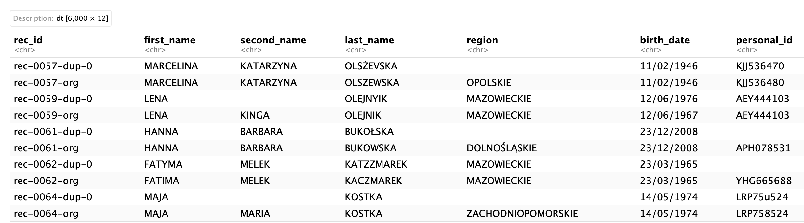

# Repo for the uRos 2024 presentation

Structure:

-   `codes/` -- R notebooks:
      - generate data (with `geco3` python) 
      - blocking example (`2-blocking.Rmd`)
      - record linkage example (`3-blocking.Rmd`)
-   `data/` -- folder with data for the `geco3` module
-   `data-sim/` -- 50 datasets simulated with `geco3` module
-   `results/` -- `.rds` file with simulation results based on the `codes/2-blocking.Rmd` notebook and figure for the presentation

Example dataset

